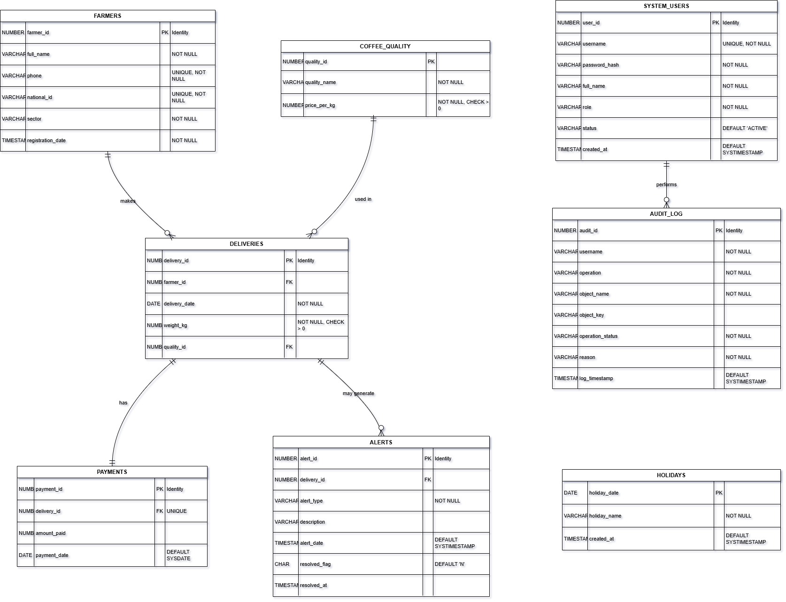

## ☕ Coffee Farmers Payment & Weight Checker System

Student: INEZA Agape
Student ID: 27464
Course: Database Development with PL/SQL (INSY 8311)
Institution: Adventist University of Central Africa (AUCA)
Lecturer: Eric Maniraguha

---
## 📋 Table of Contents

1. [Project Overview](#1-project-overview)
2. [Features](#2-features)
3. [Database Schema](#3-database-schema)
4. [Business Rules](#4-business-rules)
5. [Screenshots](#5-screenshots)
6. [Innovation & Key-Differentiators](#6-innovation--key-differentiators)
7. [Links](#7-links)

---
##🎯 Project Overview

A comprehensive Oracle PL/SQL database system for managing coffee farmers' deliveries, payments, and quality grading at washing stations. The system automates payment calculations, enforces business rules, provides audit trails, and offers business intelligence capabilities.

##✨ Features

✅ Automated Payment Calculation - Real-time payment computation based on weight and quality

✅ Business Rule Enforcement - No operations on weekdays or public holidays

✅ Comprehensive Audit Trail - Every system action logged with context

✅ Anomaly Detection - Real-time fraud detection for suspicious deliveries

✅ Role-Based Access Control - Different permissions for clerks, managers, and admins

✅ Business Intelligence - Window functions for analytics and reporting

✅ Data Validation - Comprehensive input validation and constraints

✅ Multi-Tenant Ready - Scalable architecture for multiple cooperatives
---
## 🗄️ Database Schema
# Core Tables

| Table Name       | Description                       |
|------------------|-----------------------------------|
| FARMERS          | Farmer registration and details   |
| COFFEE_QUALITY   | Quality grades with pricing       |
| DELIVERIES       | Coffee delivery records           |
| PAYMENTS         | Automated payment calculations    |
| SYSTEM_USERS     | Application authentication        |
| AUDIT_LOG        | Comprehensive audit trail         |
| HOLIDAYS         | Public holiday management         |
| ALERTS           | Anomaly detection alerts          |

#Entity Relationship Diagram
text
FARMERS (1) ───┐
               │
COFFEE_QUALITY (1) ───┐
                     │
                 DELIVERIES (1) ─── PAYMENTS (1)
                     │
                 ALERTS (0..N)
                     │
SYSTEM_USERS (1) ─── AUDIT_LOG (N)
                     │
                 HOLIDAYS

# ⚖️ Business Rules

## **Rule 1: No Weekday Operations**
All write operations (INSERT, UPDATE, DELETE) on core tables are blocked from **Monday to Friday**.  
A validation trigger checks the current weekday and prevents changes.

**System Behavior**
- If a restricted operation is attempted during Mon–Fri, the system cancels the action.
- Raises a custom error:  
  **ORA-20040: FARMERS Table: Operation not allowed on weekdays**  
  (Message differs per table.)

**Purpose**
- Protects data integrity by restricting operations to approved days only.

---

## **Rule 2: No Holiday Operations**
System prevents write operations if the current date is listed in the **HOLIDAYS** table.

**How It Works**
- Trigger checks today's date against the holiday list.
- If it matches → operation is blocked.
- Works together with the weekday rule for double protection.

**Purpose**
- Ensures no system changes occur during official non-working days.

---

## **Rule 3: Automatic Payment Calculation**
The PAYMENTS table is updated automatically based on recorded deliveries.

**Payment Formula**
payment_amount = weight_kg × price_per_kg

**How It Works**
- System retrieves **price_per_kg** from `COFFEE_QUALITY`.
- Trigger inserts the calculated payment into `PAYMENTS`.
- No manual payment entry needed.

**Purpose**
- Prevents errors and guarantees consistent payment computation.

---

## **Rule 4: Anomaly Detection (Weight Deviation Alerts)**
System monitors delivery weights for sudden abnormal deviations.

**Trigger Behavior**
- Every new delivery is compared to the farmer's historical average.
- If deviation exceeds **50%** (configurable per farmer), an entry is added to the `ALERTS` table.

**Purpose**
- Detects unusual activity (fraud, measurement faults, or inconsistencies).
- Provides real-time reporting and audit trail.

---

🚀 Innovation Highlights
1. Context-Aware Business Rules
Intelligent restrictions that understand weekday/holiday combinations and weekend allowances.

2. Predictive Anomaly Detection
Personalized thresholds based on each farmer's delivery history with real-time alerts.

3. Rwanda-Specific Design
Local phone validation, holiday recognition, and business process alignment.

4. Enterprise-Grade Architecture
Modular packages, comprehensive audit trails, and real-time business intelligence.

5. Production-Ready Security
Multi-layer security with role-based access control and complete auditability.
